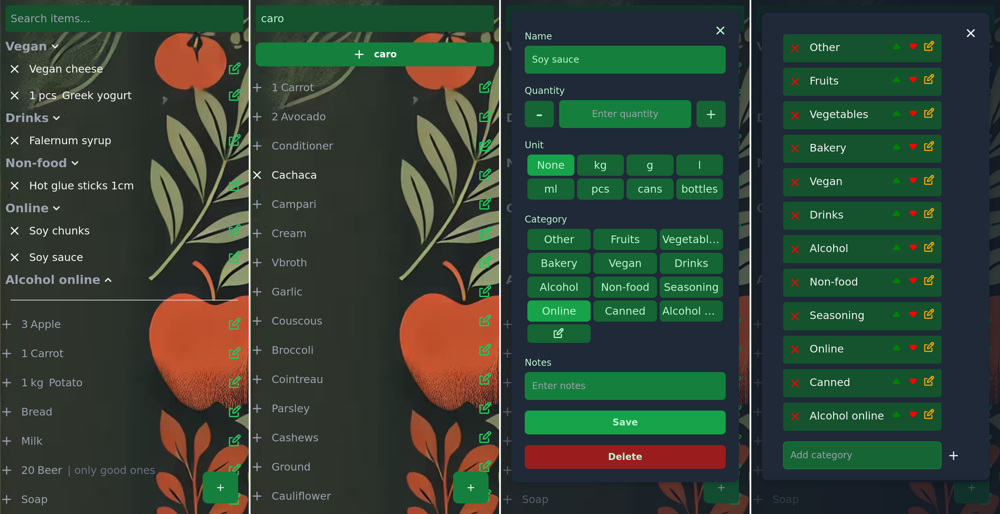

# 🛒 Boued

A simple, self-hostable web app to manage groceries and shopping lists, built with a FastAPI backend and a SvelteKit frontend.



---

## 🧰 Features

- Real-time grocery list management
- Item categories and notes
- Search and toggle active/inactive items
- WebSocket-based sync
- Authenticated access
- SvelteKit + FastAPI + SQLite

---

## 🧱 Project Structure

- `backend/`: FastAPI backend, models, routes, and WebSocket
- `frontend/`: SvelteKit app
- REST API exposed under `/api`

---

## 📦 Deployment

### Using nix

```bash
nix run .
```

---

### 🔁 Reverse Proxy (Caddy)

```Caddyfile
boued.example.com {
	reverse_proxy localhost:6001
}
```

---

## ⚙️ Stack

- **Backend**: Python, FastAPI, SQLModel, WebSocket
- **Frontend**: SvelteKit, TailwindCSS
- **DB**: SQLite
- **Auth**: JWT-based
